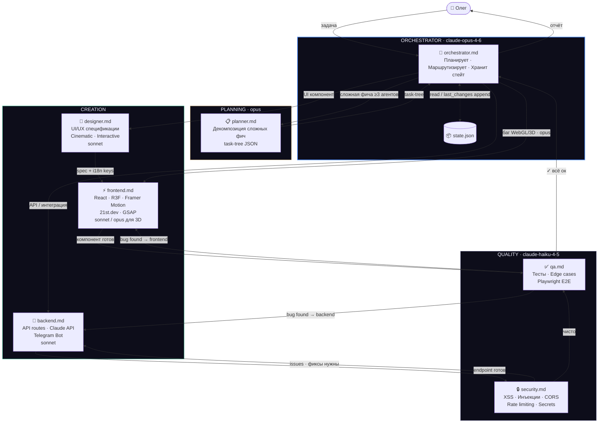
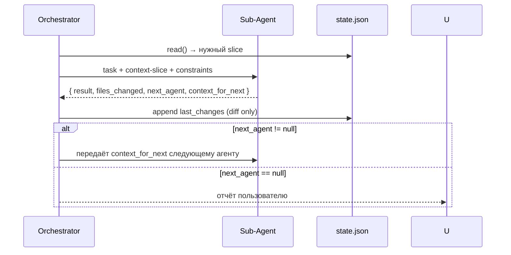

# Agent Flow — Optisphere

> **VS Code:** установить расширение [Markdown Preview Mermaid Support](https://marketplace.visualstudio.com/items?itemName=bierner.markdown-mermaid), затем `Ctrl+Shift+V` для просмотра.  
> **GitHub:** рендерится автоматически в любом .md файле.

---

## Маршрутизация агентов

---

## Матрица: задача → цепочка → модели

```mermaid
flowchart LR
    T1["UI секция"] -->|designer→| F1["sonnet"] -->|frontend→| F2["sonnet"] -->|qa| F3["haiku"]
    T2["Cinematic 3D"] -->|designer→| G1["sonnet"] -->|frontend| G2["OPUS"] -->|qa| G3["haiku"]
    T3["API endpoint"] -->|backend→| H1["sonnet"] -->|security→| H2["haiku"] -->|qa| H3["haiku"]
    T4["Баг WebGL"] -->|frontend| I1["OPUS"] -->|qa| I2["haiku"]
    T5["Полная фича"] -->|planner→| J1["opus"] -->|...| J2["цепочки\nвыше"]

    style T2 fill:#10101E,stroke:#4F8EFF
    style T4 fill:#10101E,stroke:#C9A96E
    style T5 fill:#10101E,stroke:#3ECFA0
    style G2 fill:#10101E,stroke:#4F8EFF,stroke-width:2px
    style I1 fill:#10101E,stroke:#4F8EFF,stroke-width:2px
    style J1 fill:#10101E,stroke:#3ECFA0,stroke-width:2px
```

---

## Обновление стейта (только диффы)

---

## Файлы системы

| Файл | Назначение |
|------|-----------|
| [orchestrator.md](orchestrator.md) | Главный агент: планировщик + маршрутизатор |
| [planner.md](planner.md) | Декомпозиция → task-tree JSON |
| [designer.md](designer.md) | UI/UX спецификации (cinematic) |
| [frontend.md](frontend.md) | React, R3F, 21st.dev, GSAP |
| [backend.md](backend.md) | API routes, Claude API, Telegram |
| [security.md](security.md) | Аудит безопасности |
| [qa.md](qa.md) | Тесты + E2E |
| [state.json](state.json) | Общий стейт проекта |
| [tasks/](tasks/) | Задачи для команды |
